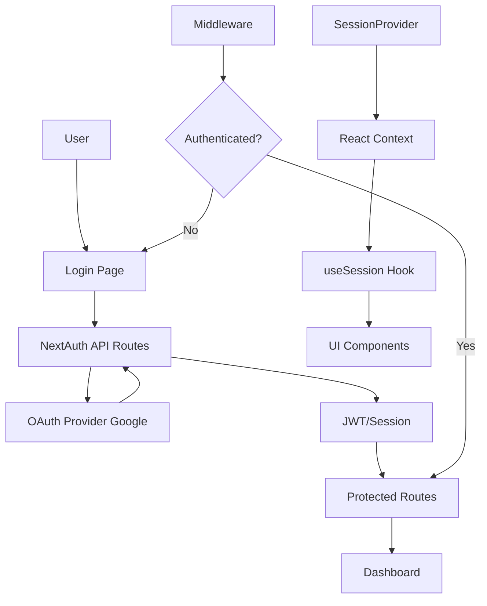

# NextAuth.js Setup Guide for Next.js Dashboard

This guide provides complete step-by-step instructions to set up NextAuth.js authentication in your Next.js dashboard application.

## Table of Contents
1. [Architecture Overview](#architecture-overview)
2. [Step 1: Create NextAuth Configuration](#step-1-create-nextauth-configuration)
3. [Step 2: Set up API Route Handler](#step-2-set-up-api-route-handler)
4. [Step 3: Configure Environment Variables](#step-3-configure-environment-variables)
5. [Step 4: Create Authentication Components](#step-4-create-authentication-components)
6. [Step 5: Add Session Provider](#step-5-add-session-provider)
7. [Step 6: Create Login Page](#step-6-create-login-page)
8. [Step 7: Add Middleware for Route Protection](#step-7-add-middleware-for-route-protection)
9. [Step 8: Update Navigation Components](#step-8-update-navigation-components)
10. [How Everything Works](#how-everything-works)

## Architecture Overview



## Step 1: Create NextAuth Configuration

Create `auth.ts` in your project root:

```typescript
// auth.ts
import NextAuth from "next-auth"
import Google from "next-auth/providers/google"
import { NextAuthConfig } from "next-auth"

export const config = {
  providers: [
    Google({
      clientId: process.env.GOOGLE_CLIENT_ID,
      clientSecret: process.env.GOOGLE_CLIENT_SECRET,
    })
  ],
  callbacks: {
    authorized({ auth, request: { nextUrl } }) {
      const isLoggedIn = !!auth?.user
      const isOnDashboard = nextUrl.pathname.startsWith('/dashboard')
      
      if (isOnDashboard) {
        if (isLoggedIn) return true
        return false // Redirect unauthenticated users to login page
      } else if (isLoggedIn) {
        return Response.redirect(new URL('/dashboard', nextUrl))
      }
      return true
    },
    session({ session, token }) {
      if (token.sub && session.user) {
        session.user.id = token.sub
      }
      return session
    },
    jwt({ token, user }) {
      if (user) {
        token.sub = user.id
      }
      return token
    },
  },
  pages: {
    signIn: '/login',
  },
} satisfies NextAuthConfig

export const { handlers, auth, signIn, signOut } = NextAuth(config)
```

## Step 2: Set up API Route Handler

Create the API route at `app/api/auth/[...nextauth]/route.ts`:

```typescript
// app/api/auth/[...nextauth]/route.ts
import { handlers } from "@/auth"

export const { GET, POST } = handlers
```

This creates all the necessary authentication endpoints:
- `/api/auth/signin` - Sign in page
- `/api/auth/signout` - Sign out
- `/api/auth/callback/google` - OAuth callback
- `/api/auth/session` - Get session data

## Step 3: Configure Environment Variables

Create `.env.local` file in your project root:

```bash
# .env.local
NEXTAUTH_URL=http://localhost:3000
NEXTAUTH_SECRET=your-secret-key-here-use-openssl-rand-base64-32

# Google OAuth
GOOGLE_CLIENT_ID=your-google-client-id
GOOGLE_CLIENT_SECRET=your-google-client-secret
```

### How to Get Google OAuth Credentials:

1. Go to [Google Cloud Console](https://console.cloud.google.com/)
2. Create a new project or select existing one
3. Enable Google+ API
4. Go to "Credentials" → "Create Credentials" → "OAuth 2.0 Client ID"
5. Set authorized redirect URIs: `http://localhost:3000/api/auth/callback/google`
6. Copy Client ID and Client Secret to your `.env.local`

Generate NEXTAUTH_SECRET:
```bash
openssl rand -base64 32
```

## Step 4: Create Authentication Components

Create `app/ui/auth/auth-buttons.tsx`:

```typescript
// app/ui/auth/auth-buttons.tsx
import { signIn, signOut } from "@/auth"
import { Button } from "@/app/ui/button"

export function SignIn() {
  return (
    <form
      action={async () => {
        "use server"
        await signIn("google")
      }}
    >
      <Button type="submit" className="w-full">
        Sign in with Google
      </Button>
    </form>
  )
}

export function SignOut() {
  return (
    <form
      action={async () => {
        "use server"
        await signOut()
      }}
    >
      <Button type="submit" variant="outline">
        Sign Out
      </Button>
    </form>
  )
}
```

## Step 5: Add Session Provider

Update your `app/layout.tsx` to include the SessionProvider:

```typescript
// app/layout.tsx
import '@/app/ui/global.css'
import { inter } from '@/app/ui/fonts'
import { SessionProvider } from "next-auth/react"
import { auth } from "@/auth"

export default async function RootLayout({
  children,
}: {
  children: React.ReactNode
}) {
  const session = await auth()
  
  return (
    <html lang="en">
      <body className={`${inter.className} antialiased`}>
        <SessionProvider session={session}>
          {children}
        </SessionProvider>
      </body>
    </html>
  )
}
```

## Step 6: Create Login Page

Create `app/login/page.tsx`:

```typescript
// app/login/page.tsx
import { SignIn } from '@/app/ui/auth/auth-buttons'
import { auth } from '@/auth'
import { redirect } from 'next/navigation'

export default async function LoginPage() {
  const session = await auth()
  
  if (session) {
    redirect('/dashboard')
  }

  return (
    <main className="flex items-center justify-center md:h-screen">
      <div className="relative mx-auto flex w-full max-w-[400px] flex-col space-y-2.5 p-4 md:-mt-32">
        <div className="flex h-20 w-full items-end rounded-lg bg-blue-500 p-3 md:h-36">
          <div className="w-32 text-white md:w-36">
            <h1 className="text-2xl font-bold">Dashboard</h1>
          </div>
        </div>
        <div className="flex flex-col space-y-4 bg-gray-50 px-6 pb-4 pt-8">
          <h2 className="text-xl font-semibold">Sign in to your account</h2>
          <SignIn />
        </div>
      </div>
    </main>
  )
}
```

## Step 7: Add Middleware for Route Protection

Create `middleware.ts` in your project root:

```typescript
// middleware.ts
import { auth } from "@/auth"
 
export default auth((req) => {
  // req.auth contains the session data
  const { nextUrl } = req
  
  const isLoggedIn = !!req.auth
  const isOnDashboard = nextUrl.pathname.startsWith('/dashboard')
  const isOnLogin = nextUrl.pathname.startsWith('/login')
  
  if (isOnDashboard && !isLoggedIn) {
    return Response.redirect(new URL('/login', nextUrl))
  }
  
  if (isOnLogin && isLoggedIn) {
    return Response.redirect(new URL('/dashboard', nextUrl))
  }
})

// Configure which routes to run middleware on
export const config = {
  matcher: [
    '/((?!api|_next/static|_next/image|favicon.ico).*)',
  ],
}
```

## Step 8: Update Navigation Components

Add authentication status to your navigation. Update `app/ui/dashboard/sidenav.tsx`:

```typescript
// app/ui/dashboard/sidenav.tsx
import Link from 'next/link'
import { auth } from '@/auth'
import { SignOut } from '@/app/ui/auth/auth-buttons'
// ... other imports

export default async function SideNav() {
  const session = await auth()
  
  return (
    <div className="flex h-full flex-col px-3 py-4 md:px-2">
      {/* Logo */}
      <Link
        className="mb-2 flex h-20 items-end justify-start rounded-md bg-blue-600 p-4 md:h-40"
        href="/"
      >
        <div className="w-32 text-white md:w-40">
          {/* Your logo here */}
        </div>
      </Link>
      
      {/* Navigation Links */}
      <div className="flex grow flex-row justify-between space-x-2 md:flex-col md:space-x-0 md:space-y-2">
        {/* Your existing nav links */}
        
        {/* User info and sign out */}
        <div className="hidden h-auto w-full grow rounded-md bg-gray-50 md:block">
          {session?.user && (
            <div className="flex flex-col p-4">
              <p className="text-sm">Signed in as:</p>
              <p className="text-sm font-medium">{session.user.email}</p>
              <div className="mt-4">
                <SignOut />
              </div>
            </div>
          )}
        </div>
      </div>
    </div>
  )
}
```

## How Everything Works

### Authentication Flow Diagram

```
1. User visits protected route (/dashboard)
   ↓
2. Middleware checks authentication
   ↓
3. If not authenticated → Redirect to /login
   ↓
4. User clicks "Sign in with Google"
   ↓
5. Redirects to Google OAuth
   ↓
6. Google redirects back to /api/auth/callback/google
   ↓
7. NextAuth processes the callback
   ↓
8. Creates JWT token and session
   ↓
9. Redirects user to /dashboard
   ↓
10. User can access protected routes
```

### Key Components Explained:

1. **auth.ts**: Central configuration file that sets up providers, callbacks, and session handling
2. **API Routes**: Handle OAuth flows and session management automatically
3. **Middleware**: Protects routes by checking authentication status before page loads
4. **SessionProvider**: Makes session data available throughout your React component tree
5. **Server Actions**: Handle sign in/out operations securely on the server side

### Session Management:

- **JWT Mode**: Tokens stored in HTTP-only cookies (default, more scalable)
- **Database Mode**: Sessions stored in database (requires database adapter)
- **Callbacks**: Customize token and session data

### Security Features:

- CSRF protection
- HTTP-only cookies
- Secure cookie settings in production
- Token rotation
- Built-in security headers

## Next Steps

1. Test the authentication flow
2. Add more OAuth providers if needed
3. Customize the UI/UX
4. Add role-based access control
5. Connect to your database for user persistence

## Troubleshooting

**Common Issues:**

1. **"Missing NEXTAUTH_SECRET"**: Make sure you have `NEXTAUTH_SECRET` in `.env.local`
2. **OAuth errors**: Check your Google OAuth credentials and redirect URIs
3. **Middleware not working**: Ensure `middleware.ts` is in the project root
4. **Session not available**: Make sure `SessionProvider` wraps your app

**Debug Mode:**
Add to `.env.local` for detailed logs:
```bash
NEXTAUTH_DEBUG=true
```

Remember to never commit your `.env.local` file to version control!